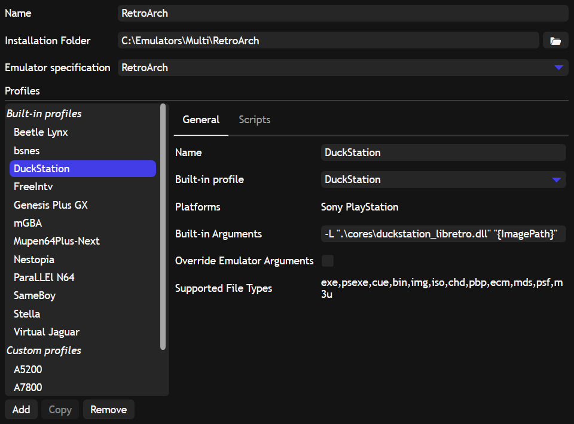
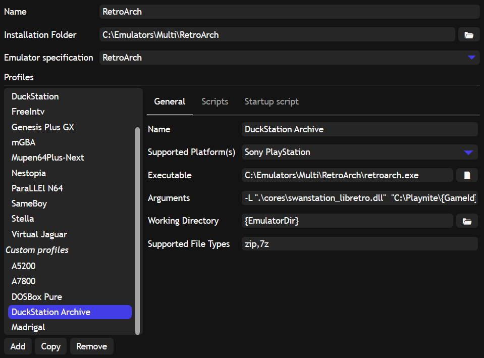
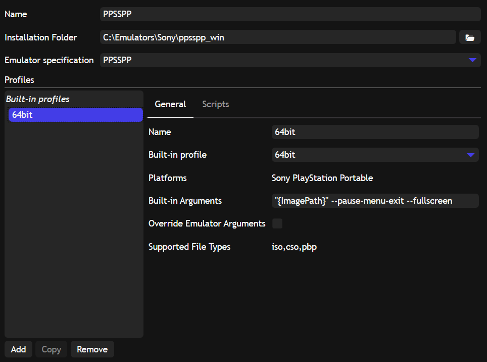
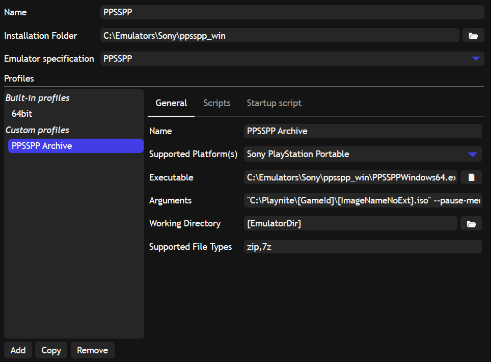

# archive-unpacker for Playnite
This repository contains a [Playnite](https://playnite.link) Add-On to decompress zip and 7z archives using [7zip](https://www.7-zip.org/) 

## Features
* Decompress archives in a temporary cache folder before launching the emulator.
* Clean up the folder on exit maintaining the most recently used files.

## Setup
You can download the plugin from the [releases page](https://github.com/Nyarlathotep7777/archive-unpacker/releases).
You can install the `*.pext` file in two ways:
  * Opening directly the file
  * Drag and drop the file into Playnite

## Configuration
Before using the plugin some configurations are needed.

Inside Playnite go into the Add-Ons menu (press F9) and in the submenu Generic -> Archive Unpacker set the following options:

| Configuration                            | Default value                     | Description                                          |
|------------------------------------------|-----------------------------------|------------------------------------------------------|
| 7-Zip Path:                              | C:\Program Files\7-Zip\7z.exe     | Path of the 7zip executable file                     |
| Cache folder Path:                       | C:\Playnite\                      | Path of the cache folder                             |
| Cache folder Size:                       | 5 GB                              | Size of the cache folder                             |
| Confirm before removing cache files:     | Checked                           | Asks for confirmation before removing files          |
| Save additional details:                 | Unchecked                         | Save additional info about the actions performed     |

## Emulator configuration
A specific configuration is needed for each emulator: as far as I know Playnite API doesn't allow to dinamically change the game path, so you need to create a proper configuration. 

Inside Playnite go in Library -> Configure Emulators (Ctrl + T) and add a new configuration, some examples below for Retroarch and for other emulators.

After that import the games from compressed folder using the new configuration.

### Retroarch cores
Starting from an existing configuration, in example DuckStation built-in configuration:
> 

Create a new custom configuration, with following parameters:
  * Name: you can choose the name, in this example `DuckStation Archive`
  * Supported platform: same choice as in built-in configuration, in this example `Sony Playstation`
  * Executable: path of Retroarch emulator, in this example `"C:\Emulators\Multi\RetroArch\retroarch.exe"`
  * Arguments: replace `"{ImagePath}"` from  built-in configuration with `"CACHE_FOLDER\{GameId}\{ImageNameNoExt}.EXTENSION"`, in this example `-L ".\cores\swanstation_libretro.dll" "C:\Playnite\{GameId}\{ImageNameNoExt}.cue"`
  * Working Directory: leave `{EmulatorDir}`
  * Supported File Types: put `zip,7z` (no other extensions are allowed)
> 

### Other emulators
Starting from an existing configuration, in example PPSSPP built-in configuration:
> 

Create a new custom configuration, with following parameters:
  * Name: you can choose the name, in this example `PPSSPP Archive`
  * Supported platform: same choice as in built-in configuration, in this example `Sony Playstation Portable`
  * Executable: path of the emulator, in this example `"C:\Emulators\Sony\ppsspp_win\PPSSPPWindows64.exe"`
  * Arguments: replace `"{ImagePath}"` from  built-in configuration with `"CACHE_FOLDER\{GameId}\{ImageNameNoExt}.EXTENSION"`, in this example `"C:\Playnite\{GameId}\{ImageNameNoExt}.iso" --pause-menu-exit --fullscreen`
  * Working Directory: leave `{EmulatorDir}`
  * Supported File Types: put `zip,7z` (no other extensions are allowed)
> 
